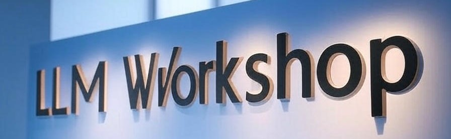

# LLMWorkshop

This workshop contains a curated collection of tutorials/projects with complete code for experimenting with Large Language Models (LLMs). This repository serves as a practical learning resource for understanding, using, and deploying LLMs with modern tools and frameworks.

## 📚 List of Tutorials / Projects

1. First bot
2. RAG bot
3. RAG bot with GUI
4. Tool calling bot
5. Writing Style mimic bot
6. Run models using Ollama
7. Langchain style formatter (in progress!)

👤 Author: Developed and maintained by [Muhammad Asif Khan](https://muasifk.github.com/).

